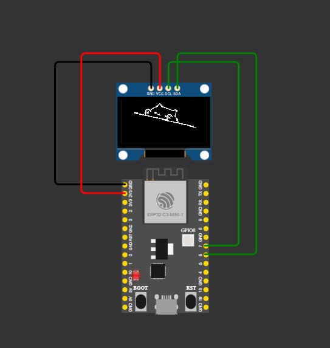

# Bongo Cat

<p align="center">
  
</p>

Bongo Cat animation running on an **ESP32-C3** driving a **128×64 SSD1306 OLED** over I²C. The cat's paws are controlled live from your PC keyboard — type with your left hand and the cat's left paw drops, type with your right hand and the right paw drops, hit space / enter / backspace and both paws come down. After 10 seconds of no typing the cat falls asleep with closed eyes and floating "Zzz".

- **Hardware:** ESP32-C3 DevKitM-1 + SSD1306 (I²C, address `0x3C`)
- **Framework:** PlatformIO + Arduino
- **Desktop app:** Electron 35 + React 19 + TypeScript + Tailwind 4 (neobrutalist UI)
- **Bridge:** Python (pyserial, bleak, pynput fallback, `GetAsyncKeyState` on Windows)
- **Simulation:** Wokwi (VS Code extension)

## Repository

[github.com/SukunDev/bongo-cat](https://github.com/SukunDev/bongo-cat)

## Hardware wiring

| SSD1306 | ESP32-C3 |
|---------|----------|
| `VCC`   | `3V3`    |
| `GND`   | `GND`    |
| `SDA`   | `GPIO6`  |
| `SCL`   | `GPIO7`  |

I²C clock runs at **400 kHz** (fast mode) so frames refresh in ~25 ms. The OLED has no reset pin (`OLED_RESET = -1`). Bitmap frames are 128×40 pixels drawn at the top of the 64-pixel display. If you change pins in [esp32/src/main.cpp](esp32/src/main.cpp), update [esp32/diagram.json](esp32/diagram.json) to match or Wokwi will silently fail to render.

## Getting started

### 1. Prerequisites

- [Git](https://git-scm.com/downloads)
- [Node.js 20+](https://nodejs.org/) (for the desktop app)
- [Python 3.8+](https://www.python.org/downloads/) (for the bridge)
- [PlatformIO Core](https://platformio.org/install/cli) — install via `pip` or as part of the [PlatformIO VS Code extension](https://platformio.org/install/ide?install=vscode)
  ```bash
  pip install -U platformio
  ```
- (Optional) [Wokwi for VS Code](https://marketplace.visualstudio.com/items?itemName=wokwi.wokwi-vscode) to run the simulation without real hardware

Make sure `pio --version` works in a fresh terminal before continuing. On Windows the PlatformIO binaries live in `%USERPROFILE%\.platformio\penv\Scripts` — add that folder to your user `PATH` if the command is not found.

### 2. Clone the repository

```bash
git clone https://github.com/SukunDev/bongo-cat.git
cd bongo-cat
```

### 3. Install dependencies

**ESP32 firmware** — Arduino libraries are fetched automatically on first build:

```bash
cd esp32 && pio run
```

**Python bridge:**

```bash
pip install -r apps/bridge/requirements.txt
```

**Desktop app:**

```bash
cd apps/desktop && npm install
```

## ESP32 firmware

### Build & upload

```bash
cd esp32

# Build firmware
pio run

# Upload to the connected ESP32-C3
pio run -t upload

# Serial monitor (baud already set via monitor_speed in platformio.ini)
pio device monitor
```

Environment name is `esp32-c3-devkitm-1`.

### Wokwi simulation

1. Build the firmware first — Wokwi reads `esp32/.pio/build/esp32-c3-devkitm-1/firmware.bin` and `firmware.elf`.
2. Open [esp32/diagram.json](esp32/diagram.json) in VS Code and run the **Wokwi: Start Simulator** command.
3. Wiring and the SSD1306 part are already defined; no extra setup needed.

### Sleep animation

The firmware tracks `lastInputTime` from serial events. After 10 seconds with no input (and both paws up), the display switches to a sleep loop — closed eyes + three "z" characters that float up and down every 500 ms. Any keystroke resets the timer and snaps back to the normal animation instantly.

## Desktop app

The desktop app is an Electron + React GUI that spawns the Python bridge as a child process, listens for bridge events via IPC, and visualizes the cat's state in real time.

```bash
cd apps/desktop

# Development with hot reload
npm run dev

# Production build
npm run build
```

### Features

- **Live bongo cat visualization** — CSS-rendered cat with animated paws that mirror the physical device
- **Sleep mode** — after 10 s of no input, the on-screen cat closes its eyes and shows floating "Zzz"
- **Connection status** — USB (with auto-detected COM port) and BLE indicators
- **Settings page** — "Open on Startup" (uses `app.setLoginItemSettings`) and "System Tray" (minimize to tray, double-click icon to restore)
- **Frameless window** with custom title bar (drag region + traffic-light window controls)

### Launch script note

The `dev` and `preview` scripts go through `scripts/launch.js` instead of calling `electron-vite` directly. This is because VSCode / Claude Code terminals set `ELECTRON_RUN_AS_NODE=1`, which would force Electron to run as plain Node.js (making `require('electron')` return the binary path string rather than the API). The launch script strips that env var before spawning electron-vite.

## Controlling the cat

### Serial protocol

The firmware listens on USB serial at **115200 baud** and accepts single-character commands:

| Char | Action             |
|------|--------------------|
| `L`  | left paw down      |
| `l`  | left paw up        |
| `R`  | right paw down     |
| `r`  | right paw up       |

Frames are only redrawn when the `left`/`right` state actually changes.

### Keyboard bridge

The Python bridge (`apps/bridge/`) captures keyboard events system-wide and streams paw commands to the ESP32.

**Standalone usage** (without the desktop app):

```bash
py apps/bridge/main.py
```

**Key mapping (direct — no mirror):**

| Keyboard area | Keys | Drives |
|---------------|------|--------|
| Left hand     | `Q W E R T`, `A S D F G`, `Z X C V B`, `1–5`, Left Shift/Ctrl/Alt/Win, Caps Lock | left paw |
| Right hand    | `Y U I O P`, `H J K L ;`, `N M , . /`, `6–0`, Right Shift/Ctrl/Alt/Win, arrow keys, Home/End/PgUp/PgDn | right paw |
| Both          | Space, Enter, Backspace, Delete, Tab, Escape | both paws |

On **Windows**, the bridge uses `GetAsyncKeyState` polling at 1 kHz for reliable detection in subprocess contexts (where pynput's `SetWindowsHookEx` hooks don't receive events). On macOS/Linux it falls back to pynput.

The bridge also auto-detects the ESP32 via USB VID/PID scanning and has a BLE scanner skeleton (actual BLE transport on the ESP32 side is not implemented yet).

### Legacy standalone script

A simpler standalone script is available at [esp32/tools/bongo_keymap.py](esp32/tools/bongo_keymap.py) for direct serial control without the bridge architecture:

```bash
python esp32/tools/bongo_keymap.py COM3
```

## Project layout

```
bongo-cat/
├── esp32/                        # ESP32-C3 firmware
│   ├── src/
│   │   ├── main.cpp              # Arduino entry point with sleep mode
│   │   └── animate.h             # Four 128×40 PROGMEM bitmaps
│   ├── tools/
│   │   └── bongo_keymap.py       # Legacy standalone keyboard bridge
│   ├── diagram.json              # Wokwi wiring
│   ├── wokwi.toml                # Wokwi firmware paths
│   └── platformio.ini            # Board, framework, lib deps
├── apps/
│   ├── bridge/                   # Python bridge
│   │   ├── main.py               # Orchestrator (queue-based serial writer)
│   │   ├── protocol.py           # JSON lines stdio helpers
│   │   ├── keyboard.py           # GetAsyncKeyState polling + pynput fallback
│   │   ├── serial_conn.py        # USB serial auto-detect
│   │   ├── ble_conn.py           # BLE skeleton (bleak)
│   │   └── requirements.txt
│   └── desktop/                  # Electron + React GUI
│       ├── scripts/launch.js     # Strips ELECTRON_RUN_AS_NODE
│       ├── src/
│       │   ├── main/             # Electron main process + bridge spawner + tray
│       │   ├── preload/          # IPC exposure (window/store/bridge/settings)
│       │   └── renderer/         # React app (TanStack Router, Tailwind, shadcn)
│       │       └── src/routes/
│       │           ├── index.tsx        # Main page with CSS bongo cat
│       │           └── settings.tsx     # Settings toggles
│       └── package.json
├── docs/
│   └── superpowers/              # Design specs and implementation plans
├── stitch_export/                # Google Stitch design references
├── asset/
│   └── preview.png
├── README.md
└── CLAUDE.md
```

## Dependencies

**ESP32:**
- [adafruit/Adafruit SSD1306](https://github.com/adafruit/Adafruit_SSD1306) (pulls in Adafruit GFX transitively)

**Python bridge:**
- [pyserial](https://pypi.org/project/pyserial/) — USB serial communication
- [bleak](https://pypi.org/project/bleak/) — Bluetooth BLE
- [pynput](https://pypi.org/project/pynput/) — keyboard listener (non-Windows fallback)

**Desktop:**
- [Electron 35](https://www.electronjs.org/) + [React 19](https://react.dev/) + [TypeScript 5](https://www.typescriptlang.org/)
- [electron-vite](https://electron-vite.org/) — build tooling
- [TanStack Router](https://tanstack.com/router) + [TanStack Query](https://tanstack.com/query) — routing & state
- [Tailwind CSS 4](https://tailwindcss.com/) + shadcn/ui — styling
- [electron-store](https://www.npmjs.com/package/electron-store) — settings persistence

## Author

**SukunDev** — [github.com/SukunDev](https://github.com/SukunDev)
